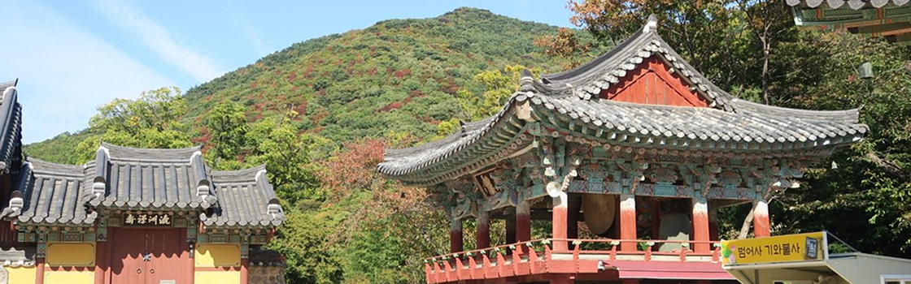
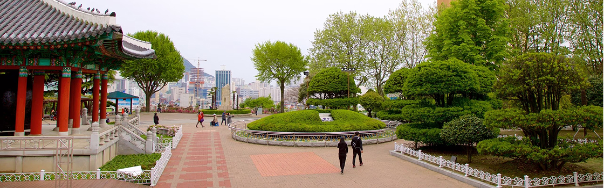

# 🌏 Descubra Busan: História, Cultura e Turismo na Coreia do Sul

Este é um projeto de página web informativa sobre a cidade de **Busan**, na Coreia do Sul. O objetivo é oferecer uma experiência rica, visualmente agradável, acessível e otimizada para mecanismos de busca (SEO).

---

## 📸 Imagens do Projeto

### Página Hero (Topo)


---

### Destinos Históricos

#### Templo Haedong Yonggungsa


#### Templo Beomeo-sa


#### Parque Yongdusan


---

## 🧩 Funcionalidades

- ✅ Layout responsivo (mobile-first)
- ✅ Estrutura semântica com HTML5
- ✅ SEO com meta tags otimizadas
- ✅ Imagens com `loading="lazy"` para desempenho
- ✅ Temas claro e escuro com botão flutuante
- ✅ Variáveis CSS para fácil personalização
- ✅ Transições suaves e efeitos visuais

---

## 🧠 Tecnologias Utilizadas

- HTML5
- CSS3 (customizado e com variáveis)
- JavaScript (para alternância de tema)
- Open Sans (Google Fonts)

---

## 🎨 Alternância de Tema

O site conta com um botão fixo no canto inferior direito que permite alternar entre os modos:

- ☀️ Tema Claro
- 🌙 Tema Escuro

A preferência é armazenada no navegador via `localStorage`.

---

## 📁 Estrutura de Pastas

```
/
├── assets/
│   ├── img_hero.jpg
│   ├── img_haedong.jpg
│   ├── img-beomeo-sa.jpg
│   ├── img-yongdusan.jpg
│   └── heart.svg
├── index.html
├── style.css
└── README.md
```

---

## 🚀 Como Visualizar Localmente

1. Clone ou baixe este repositório
2. Abra o arquivo `index.html` em qualquer navegador moderno

---

## ✨ Autor

Desenvolvido por [Seu Nome ou Agência].

---

## 📜 Licença

Este projeto é de uso livre para fins educacionais. Créditos das imagens devem ser respeitados conforme os direitos autorais dos autores originais.
